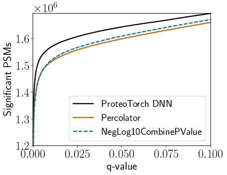
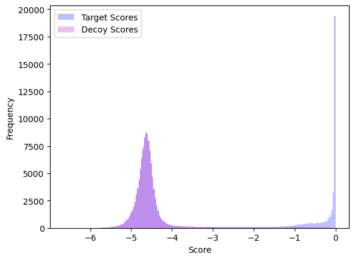

# Plot Utilities
## Plotting \# of identifications vs q-values
As discussed in the quickstart, *\# identifications vs q-value* plots are available after installation by calling **proteoTorchPlot**.  Options include
* *\-\-output*: Output file name where the figure will be stored. **Default = figure.png**
* *\-\-maxq*: Maximum q-value to plot to: 0 < q <= 1.0. **Default = 0.1**
* *\-\-tdc*: Perform target-decoy competition (boolean). **Default = true**
* *\-\-dataset*: PIN process which was analyze (only necessary if *tdc* = true).
* *\-\-writeTdcResults*: Write the results of TDC for all methods to new files. **Default = false**
* *\-\-tdcOutputDir*: Output directory to write TDC competition results. **Default = ''**

Furhter details are available in the source, module proteoTorch.plotQvals.

### Specifying PSM score files
General tab-delimited files are passed to **proteoTorchPlot** as triples *method:score header field:PSM file*, where *method* specifies the legend name, *score header field* specifies the header column name to use as PSM scores, and *PSM file* is the tab-delimited file name.  The input file must contain header fields: 
* *score header field* - column of PSM scores to compute q-values with
* *PSMId* - unique PSM IDs used in the analyzed PIN file
* *Label* - whether a PSM is a target (1) or decoy (-1)

If target and decoy results are separated into two tab-delimited files, these may be passed in as the a quartet *method: header field:target file: decoy file*.  In this case, the column *Label* does not need to be specified.

As an example, the following plots ProteoTorch and Percolator recalibrated scores for PSMs collected searching a [draft of the human proteome dataset](https://www.nature.com/articles/nature13302) using the recently developed high-res MS2 p-value score function, [*residue-evidence combined p-value*](https://pubs.acs.org/doi/10.1021/acs.jproteome.8b00206):

    proteoTorchPlot --output kim_resev.png --maxq 0.1  \
        --tdc --dataset kim_resev.pin \
        "ProteoTorch DNN":"score":output_dir/output.txt \
        "Percolator":'score':kim_resev_percTargets.txt:kim_resev_percDecoys.txt \
        "NegLog10CombinePValue":'NegLog10CombinePValue':kim_resev.pin


resulting in the plot below.



Note that, when TDC is specified, ProteoTorch generally uses the unique keys in header column **PSMId** to map PSMs to the (*experimental mass*, *scan number*) pairs specified in the original PIN file.  However, if method is specified as one of {'PeptideProphet', 'Scavager', 'q-ranker'}, it is assumed that *experimental mass* and *scan number* are explicitly provided (with respective header fields **ExpMass** and **ScanNr**) due to potential nonconformity of the supplied **PSMId** with these methods.

## Histograms
The following python script shows how to import proteoTorch plotting tools to quickly create a plot of recalibrated target and decoy scores.  PSMs were originally collected searching a dataset of [SARS-CoV-2 Proteins collected from COVID-19 patiens](https://pubs.acs.org/doi/10.1021/acs.jproteome.0c00280) using the Comet search engine:
```python
from math import log
from proteoTorch.plotQvals import load_pin_scores, histogram

filename= 'output_dir/output.txt'
scoreKey = 'score'

# load ProteoTorch output
scores, labels, _ = load_pin_scores(filename, scoreKey)

targets = [log(s) for s,l in zip(scores, labels) if l == 1]
decoys = [log(s) for s,l in zip(scores, labels) if l == -1]

output = 'ihling_comet_proteoTorchDnn_hist.png'

histogram(targets, decoys, output, bins = 200)
```
which generates the plot below.

